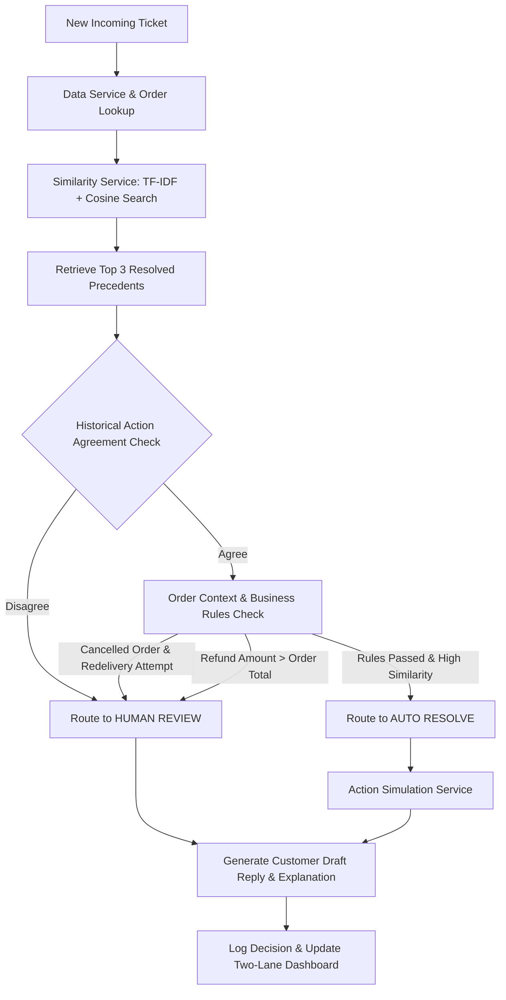

# System Architecture — Zepto Support Ticket Manager

> **Status**: PLANNED Architecture  
> High-level system workflow design for Zepto Support Ticket Manager (DigiPlus IT Agentic AI Hackathon Q4).

---

## High-Level Execution Flow

---

## Component Architecture

### 1. Data Ingestion & Storage (`data/`)
* Ingests raw CSV files (`resolved_tickets.csv`, `new_tickets.csv`, `orders_context.csv`).
* Maintained by `data_service.py`.

### 2. Similarity Engine (`backend/app/services/similarity_service.py`)
* Computes TF-IDF vector representations of 300 historical resolved tickets.
* Calculates Cosine Similarity scores for incoming tickets.
* Ranks and extracts top-3 historical precedent matches.

### 3. Business Guardrail & Decision Engine (`backend/app/services/decision_service.py`)
* **Similarity Gate**: Verifies similarity score exceeds confidence threshold.
* **Precedent Agreement Gate**: Ensures top precedents share identical or compatible resolution actions.
* **Order Guardrail Gate**: Validates order status in `orders_context.csv` (e.g. cancelled orders cannot be redelivered; refunds capped at order total value).
* **Routing Decision**: Emits `AUTO_RESOLVE` or `HUMAN_REVIEW`.

### 4. Action Simulation & Drafting (`backend/app/services/action_service.py` & `reply_service.py`)
* Simulates resolution action execution (refund, redelivery, coupon).
* Drafts customer response text.
* Builds structured audit explanation ("Why this action?").

### 5. Two-Lane Frontend Dashboard (`frontend/`)
* Displays ticket cards in **Auto-Resolved** vs **Needs-Human** lanes.
* Provides detailed ticket inspection panel with precedent cards, order context, confidence score, and drafted reply.
